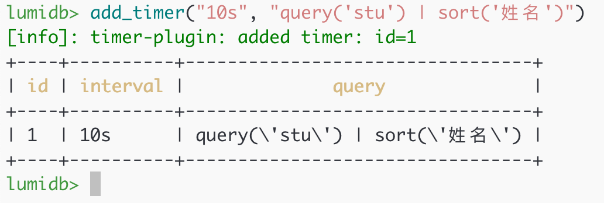

# Lumi DB Project

LumiDB 是一个简单的内存型数据库，支持特殊的查询 DSL 操作数据库，提供交互式命令行工具，支持动态链接库的插件拓展系统功能以完成需求。

## 编译与运行

本项目采用 CMake 构建系统，使用 Acutest 测试框架进行单元测试。

编译器需要支持 C++17 标准。

### On Linux

安装 Cmake 和 Clang++ 或 g++

```sh
mkdir -p build
cd build
cmake ..
make -j
make test
```

构建产物

- `build/lumidb`: LumiDB 命令行工具
- `build/src/plugins/liblumidb-timer-plugin.so`: LumiDB 插件

### On Windows

需要安装 Visual Studio 2022 生成工具，勾选安装 Clang++.

打开 VS2022 Developer Command Prompt

```sh
mkdir -p build
cd build
cmake ..
make -j
```

### 运行

编译产物位于 `build/` 文件夹，本压缩包也提供了预编译好的二进制文件，位于 `binaries/` 文件夹

由于我没有 Windows 环境，这里只提供了在 Ubuntu 22.04 上编译好的二进制文件。

直接运行 `./build/lumidb` 即可进入 LumiDB 命令行工具。


## LumiDB 功能

- 数据库以及表的增删改查
- 支持 REPL，补全与语法高亮
- 支持 Query 语言，组合函数进行查询
- 支持注册自定义函数
- 支持插件

## 测试题目功能完成情况

### 基础功能

1. 录入成绩

   成绩录入分为两个步骤

   首先，通过 `create_table` 与 `add_field` 命令建表

   ```py
   create_table("stu") | add_field("姓名", "string") | add_field("语文", "float?") | add_field("数学", "float?") | add_field("英语", "float?")
   ```

   

   之后，通过 `insert` 命令插入数据，或者通过 `load_csv` 命令从 CSV 文件中读取数据

   ```py
   insert("stu") | add_row("张三", 80, 81, 85)
   insert("stu") | load_csv("./datas/students.csv")
   ```

   

2. 查询成绩 - 查询科目最高分、最低分

   使用聚合函数 `max` 和 `min`

   ```py
   query("stu") | max("语文", "数学", "英语")
   query("stu") | min("语文", "数学", "英语")
   ```

   

3. 查询成绩 - 以各科成绩对同学排序

   使用函数 `sort`

   ```py
   query("stu") | sort("数学") | select("姓名", "数学")
   ```

   

4. 查询成绩 - 各科目平均分

   使用聚合函数 `avg`

   ```py
   query("stu") | avg("语文", "数学", "英语")
   ```

   

5. 修改成绩

   组合使用 `update`, `where`, `set_value`

   修改姓名为 王五 的数学成绩为 60，英语成绩为 70

   ```py
   update("stu") | where("姓名", "=", "王五") | set_value("数学", 60) | set_value("英语", 70)
   ```

### 插件功能

1. 加载、卸载插件

   使用 `load_plugin` 加载插件，`unload_plugin` 卸载插件，`show_plugins` 展示已加载插件列表

   ```py
   load_plugin("./build/src/plugins/liblumi-timer-plugin.so")
   show_plugins
   ```

   

   查看插件创建的函数

   ```py
   show_functions | where('type', '=', 'root') | limit(5)
   ```

   插件注册了 `find_missing_values`, `add_timer` 等函数

   

2. 查询分数缺省的数据

   使用函数 `find_missing_values`

   ```py
   find_missing_values("stu", "语文")
   ```

   

3. 注册定时任务

   使用函数 `add_timer`, `remove_timer`, `show_timers`

   - `add_timer(time, query)`: 添加定时任务 第一个参数接收时间字符串，指定多少秒执行一次，第二个参数接收具体执行的命令
   - `remove_timer(id)`: 删除定时任务
   - `show_timers`: 展示所有的定时任务

   ```sh
   add_timer("10s", "query('stu') | sort('姓名')")
   ```

   

   等待 10s 后，任务执行

   

4. 卸载插件

   ```py
   unload_plugin("1")
   ```

## 测试

测试包括单元测试和集成测试

单元测试见 `test/`

集成测试见 `e2e/`

运行单元测试

```sh
make build-test
```

运行集成测试

```sh
make e2e
```

## 设计文档

本系统的设计架构，实现细节，查询语句详细语法请参考 [DESIGN.md](DESIGN.md)。

## Third-Party

使用的第三方库的相关文件已被包含在项目源代码文件中，位于 third-party/，不需要额外进行安装。

第三方库不包含关键业务逻辑的实现，只是一些辅助代码方便使用，比如命令行参数的解析，字符串的格式化，异常栈的打印。

- [acutest](https://github.com/mity/acutest): 单元测试
- [fmtlib](https://github.com/fmtlib/fmt): 字符串格式化
- [argumentum](https://github.com/mmahnic/argumentum): 命令行参数解析
- [backward-cpp](https://github.com/bombela/backward-cpp): 异常栈帧打印
- [tabulate](https://github.com/p-ranav/tabulate): 表格格式化输出
- [isocline](https://github.com/daanx/isocline): 跨平台版 readline
